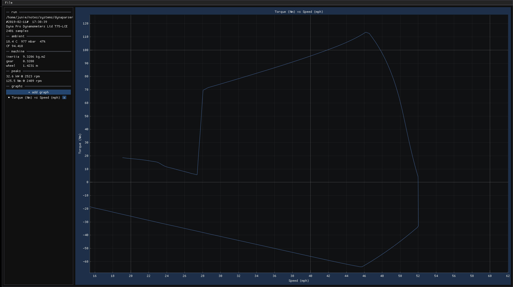

# dyno-graph-tool

viewer for dynapro dynarun v3 `.Dpr` files. parses the format, computes corrected wheel torque and power from roller inertia + angular acceleration + friction poly.

## image



## what it does

- multiple graphs, right-click any axis to pick a series
- auto-fit with 5% padding, double-click to re-fit
- series: rpm, time, speed, torque, power

## building

needs cmake ≥ 3.20 and a c++23 compiler. all deps fetched automatically.

```sh
# linux
sudo apt install libgl-dev libxrandr-dev libxinerama-dev libxcursor-dev libxi-dev libxkbcommon-dev libwayland-dev
cmake -B build -DCMAKE_BUILD_TYPE=Release
cmake --build build -j
./build/dyno_viewer

# windows
cmake -B build
cmake --build build --config Release
build\Release\dyno_viewer.exe
```

## usage

```
./dyno_viewer [path/to/file.Dpr]
```

or just launch it and drag a file in. click **+ add graph**, right-click an axis to change it, double-click to re-fit.

## deps

all fetched via cmake, you don't need to install anything besides the build prereqs above.

- [glfw](https://github.com/glfw/glfw) 3.4
- [dear imgui](https://github.com/ocornut/imgui) 1.91.8
- [implot](https://github.com/epezent/implot) 0.16
- [portable-file-dialogs](https://github.com/samhocevar/portable-file-dialogs)

## .dpr format

dynarun v3 files are csv text (cp1252), ~39 header rows then a 41-column data block. row 3 can have rtf notes with newlines inside a quoted field so the parser reads char by char. some header fields are hex-encoded ascii floats.

## torque

$$T = \frac{F(v)}{0.7375621} + I \cdot \alpha$$

$F(v)$ is friction loss in ft·lb from a cubic poly over wheel speed (mph), $I$ is roller inertia (kg·m²), $\alpha$ is angular acceleration via 51-sample buffer span. power is just $P = T \cdot RPM / 9549.3$ in kw.
